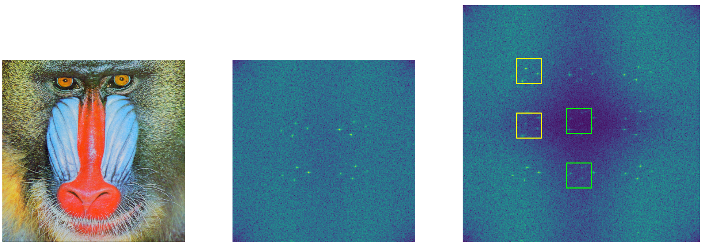
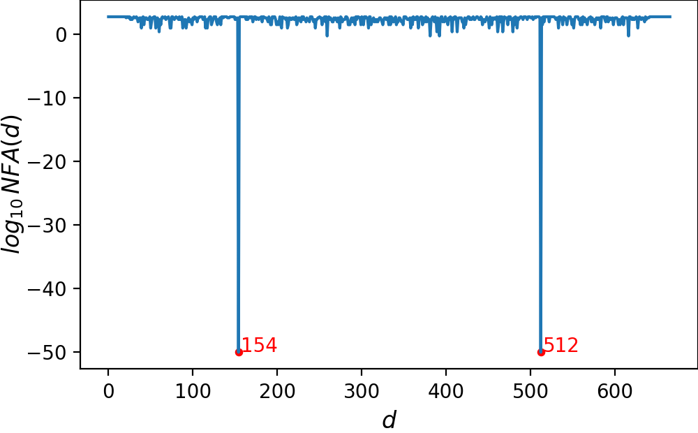

# Image Resampling Detection via Spectral Correlation and False Alarm Control

This repository contains the code for detecting image resampling in the Fourier domain.

# Introduction

Image resampling replicates and folds original frequencies in the Fourier domain. This creates replicated patterns in the Fourier spectrum in a resampled image. For example, the image below is upsampled from 512 x 512 to 666 x 666. Its spectrum after residual extraction (on the right) shows similar patterns in two local patches separated by 144 = 666 - 512 frequencies along the vertical direction.



A non-parametric statistical _a contrario_ framework is thus proposed to detect such correlations with control of number of false alarms (NFA). Below is the detection result on the above resampled image, where the NFA values at distances 144 and 512 are significantly low. This indicates a strong evidence of resampling.


<details>
  <summary>📊 Click to view detection result</summary>
  
</details>

The proposed method is suitable for identifying images resampled with different anti-aliasing filters, scaling factors, classical linear interpolators, and AI-based nonlinear interpolators, and with post-compression at different levels.

🔗 [GitHub](https://github.com/li-yanhao/ird)

📄 [Preprint](https://doi.org/10.36227/techrxiv.174235422.29936668/v1)

🚀 [Demo](https://ipolcore.ipol.im/demo/clientApp/demo.html?id=77777000537)


## Prerequisite

Tested python version: 3.10.19 (conda) and 3.10.13 (uv)

Use `conda` to create a virtual environment:
``` bash
conda create -n ird python=3.10.19
conda activate ird
pip install -r requirements.txt
```

Or use `uv` to create a virtual environment:
``` bash
uv venv .venv --python python3.10.13
source .venv/bin/activate
uv pip install -r requirements.txt
```

Compile the TV denoiser in `src/filters/CDS_ChambolleTV`:
``` bash
cd src/filters/CDS_ChambolleTV
make
```

## Test on a single image
``` bash
# Process detection on an original image without resampling
python detect_one_image.py img/baboon.png --direction h --preproc rt

# Process detection on a resampled image from 512x512 to 666x666 with bicubic interpolation method
python detect_one_image.py img/baboon_666.png --direction h --preproc rt
```

Detection results will be saved in the `results/` folder by default.

