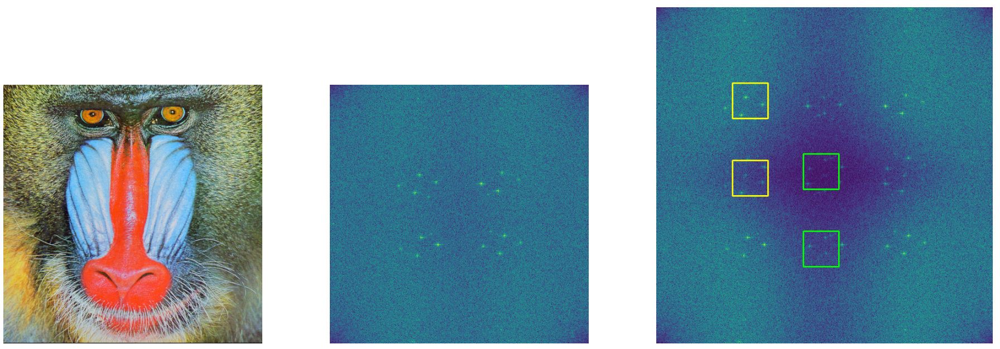
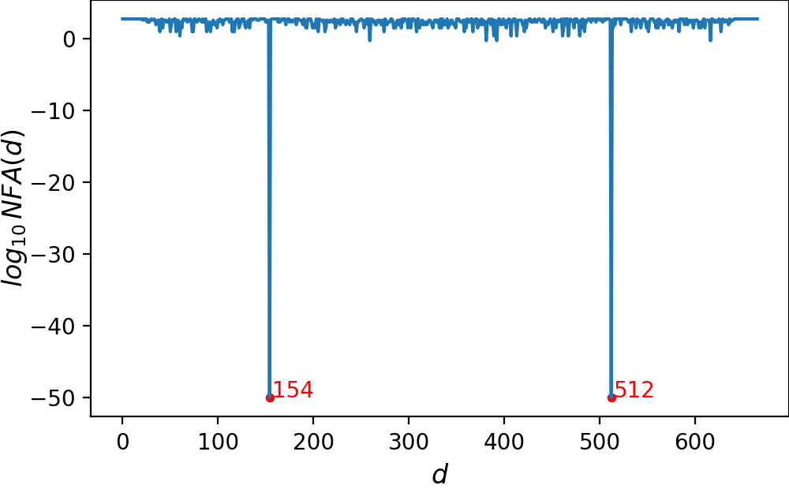

<div align="center">
<h3>Image Resampling Detection via Spectral Correlation and False Alarm Control</h3>

[[🔗`GitHub`](https://github.com/li-yanhao/ird)] [[📄`Preprint`](https://doi.org/10.36227/techrxiv.174235422.29936668/v1)] [[🚀`Demo`](https://ipolcore.ipol.im/demo/clientApp/demo.html?id=77777000537)] [[📊`Dataset`](#)]
</div>


---

## Introduction

Image resampling replicates and folds original frequencies in the Fourier domain. This creates replicated patterns in the Fourier spectrum in a resampled image. For example, the image below is upsampled from 512 x 512 to 666 x 666. Its spectrum after residual extraction (on the right) shows similar patterns in two local patches separated by 144 = 666 - 512 frequencies along the vertical direction.



A non-parametric statistical _a contrario_ framework is thus proposed to detect such correlations with control of number of false alarms (NFA). Below is the detection result on the above resampled image, where the NFA values at distances 144 and 512 are significantly low. This indicates a strong evidence of resampling.


<details>
  <summary>📊 Click to view detection result</summary>
  
</details>

The proposed method is suitable for identifying images resampled with different anti-aliasing filters, scaling factors, classical linear interpolators, and AI-based nonlinear interpolators, and with post-compression at different levels.


## Prerequisite

Tested python versions: 3.10.19 (`conda`) and 3.10.13 (`uv`)


### 1. Environment setup
Use `conda` to create a virtual environment:
``` bash
conda create -n ird python=3.10.19
conda activate ird
pip install -r requirements.txt
```

Or use `uv` to create a virtual environment:
``` bash
uv venv .venv --python python3.10.13
source .venv/bin/activate
uv pip install -r requirements.txt
```

### 2. Compile the TV denoiser
Compile the TV denoiser in `src/filters/CDS_ChambolleTV`:
``` bash
cd src/filters/CDS_ChambolleTV
make
```

## Test on a single image
Usage:
``` bash
detect_one_image.py [-h] [--direction {h,v,both}] [--preproc {rt,tv,dct,phot,none}] [--is_jpeg] [--crop x y w h] [--out_folder OUT_FOLDER] IMAGE_PATH
```
where:
- `direction`: Direction for resampling detection. `h` for horizontal, `v` for vertical, and `both` for both directions.
- `preproc`: Preprocessing method: 
  - `rt`: rank transform 
  - `tv`: total variation denoising
  - `dct`: DCT denoising 
  - `phot`: phase-only transform 
  - `none`: no preprocessing
- `is_jpeg`: Whether the input image is a JPEG compressed image. Applying this flag will suppress the spurious peaks left by JPEG compression.
- `crop`: Crop the image to the rectangle defined by (x, y, w, h).
- `out_folder`: Folder to save results. By default, results will be saved in the `results/` folder.


/Users/yli/Downloads/pashmina.jpg

Examples on PNG images:
``` bash
# Process detection on an original PNG image without resampling
python detect_one_image.py img/baboon.png --direction h --preproc rt

# Process detection on a PNG image which was upsampled from 512x512 to 666x666
python detect_one_image.py img/baboon_666.png --direction h --preproc rt
```

Examples on JPEG images (`--is_jpeg` must be flagged):
``` bash
# Process detection on an original JPEG without resampling
python detect_one_image.py img/pashmina.jpg --is_jpeg --direction h --preproc tv 

# Process detection on a JPEG image which was downsampled from 800x800 to 720x720
python detect_one_image.py img/pashmina_720.jpg --is_jpeg --direction h --preproc tv 
```

Detection results will be saved in the `results/` folder by default.


## Choice of preprocessing filter
For uncompressed images, it is recommended to use the rank transform (`rt`). For JPEG compressed images, using the total variation denoising (`tv`) as preprocessing filter gives slightly better performance.

